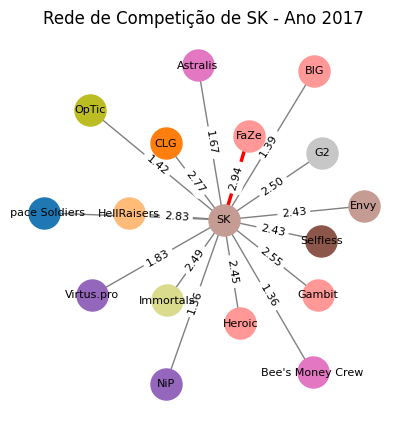

# Análise de Redes de Competição em Partidas Profissionais de CS:GO Utilizando Teoria dos Grafos

`Problema`: Utilizando a Teoria dos Grafos para Análise Estratégica de Rivalidades e Programação de Campeonatos em Partidas Profissionais de CS:GO.

## Construindo o Grafo

- `Vértices`: Cada equipe é representada como um vértice no grafo.

- `Arestas`: Uma aresta é estabelecida entre duas equipes (vértices) se elas disputaram uma partida entre si.

## Ponderando e Etiquetando as Arestas

- `Peso das Arestas`: O peso foi atribuído com base na frequência das partidas entre cada par de equipes. Por exemplo, se a equipe A jogou contra a equipe B em 10 partidas, a aresta entre A e B terá um peso maior em comparação com um par de equipes que jogou menos partidas entre si.

- `Etiquetas de Resultados`: Foram adicionadas informações sobre a contagem de vitórias/derrotas para cada par de equipes, o que ajudou a identificar rivalidades mais intensas.

- `Análise de Rank`: Posições no rank mundial na data da partida influenciam o limiar de rivalidade.

## Análise do Grafo

- `Determinando Rivalidades`: Uma alta frequência de confrontos (peso elevado nas arestas) indica uma rivalidade. Além disso, se os resultados desses confrontos forem equilibrados e a diferença do rank mundial de cada equipe, isso sugere uma rivalidade competitiva.

- `Conexões Frequentes`: Pares de equipes com um número significativo de partidas entre si serão evidentes pelo peso das arestas. Essas são as conexões mais frequentes.

## Visualização

A visualização do grafo ajuda a identificar rapidamente quais as conexões de uma equipe e quais são mais fortes.

## Algoritmo utilizado

Algoritmo de Força de Conexão (`Strength of Ties`):

Este algoritmo calcula a força das conexões (arestas) entre as equipes (vértices) com base na frequência das disputas, diferença do placar das partidas, diferença do rank das partidas e consistência da rivalidade através dos anos.

## Trabalhos Futuros

- `Contexto`: É importante considerar o contexto das partidas (como torneios importantes ou finais, rivalidade entre jogadores, rivalidade de torcidas) ao interpretar os resultados, pois eles podem adicionar uma camada adicional de significado às rivalidades identificadas.

Em resumo, a teoria dos grafos é uma ferramenta poderosa para analisar e visualizar as relações complexas e dinâmicas no cenário competitivo de Counter-Strike, permitindo identificar as maiores rivalidades e as conexões mais frequentes de forma eficaz.
